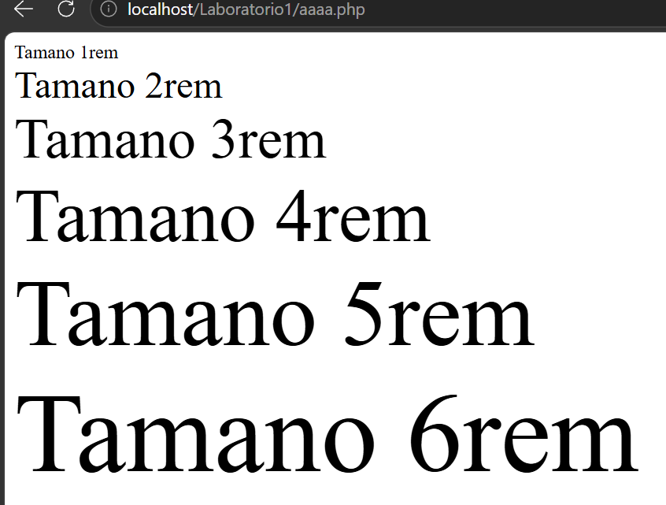
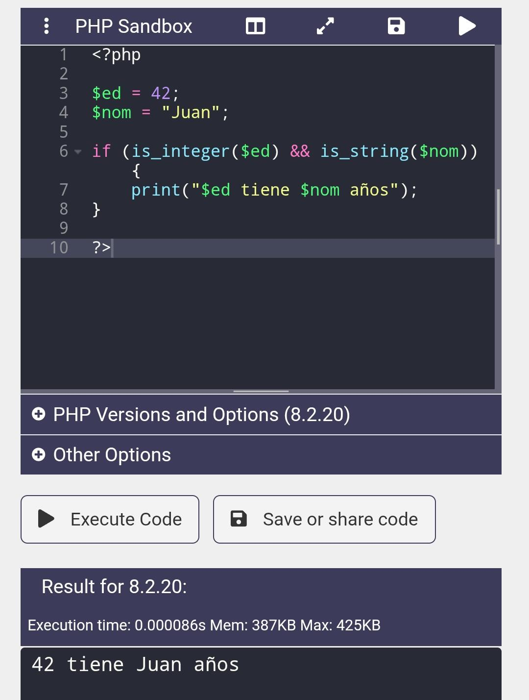
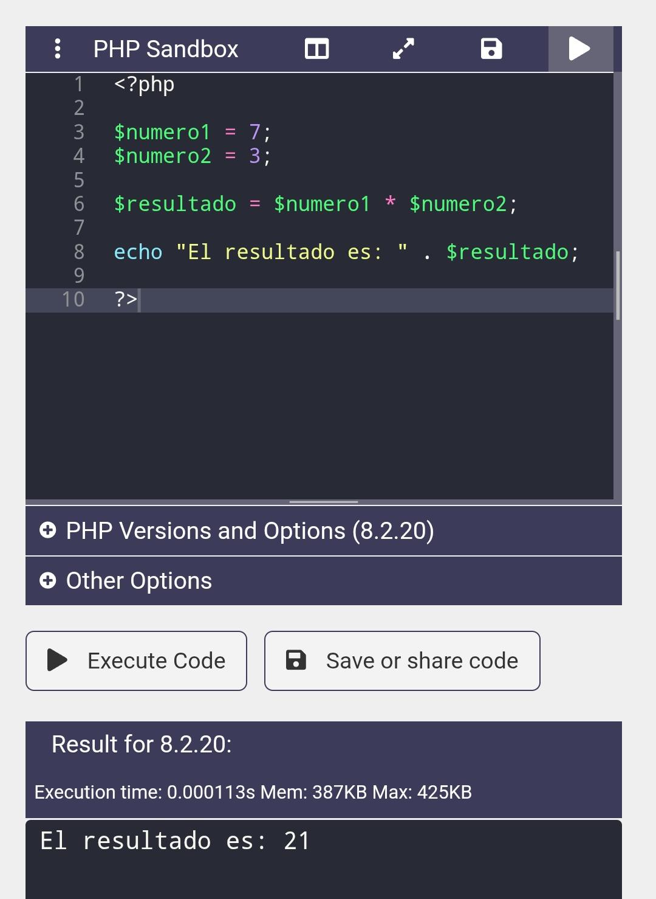
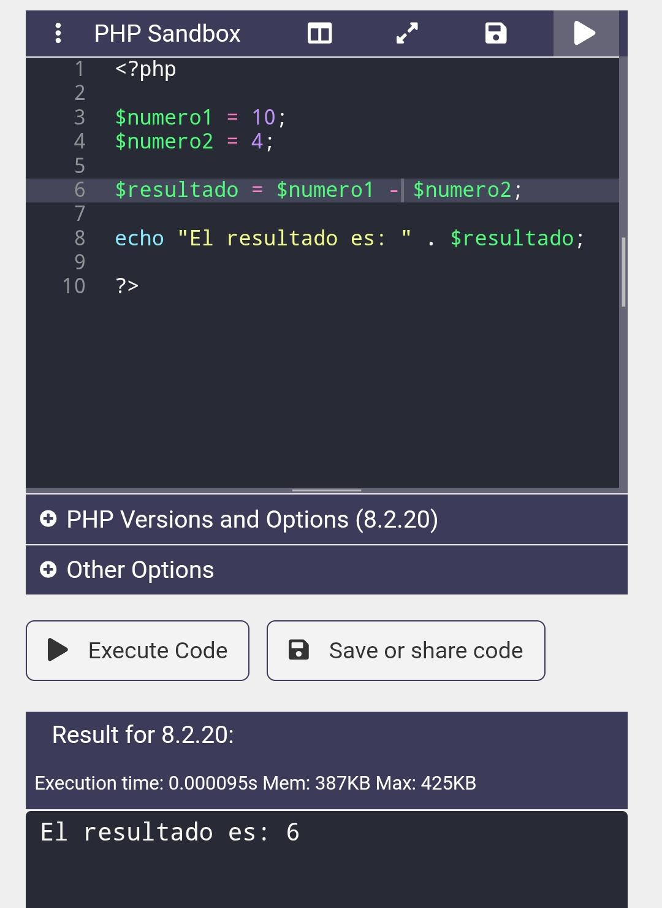
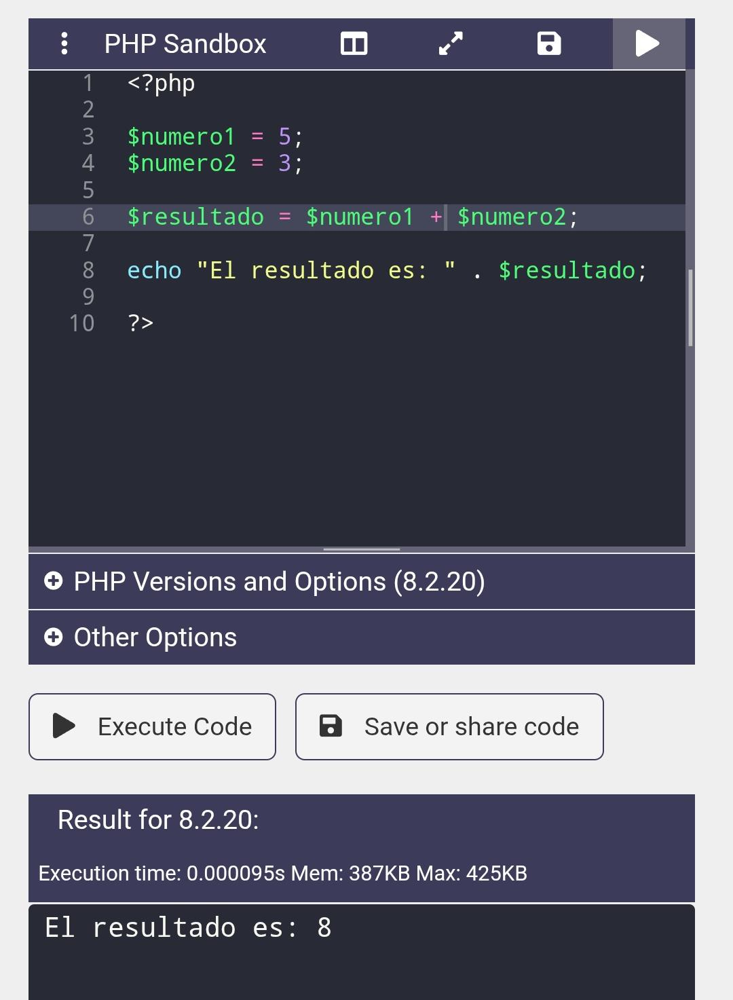
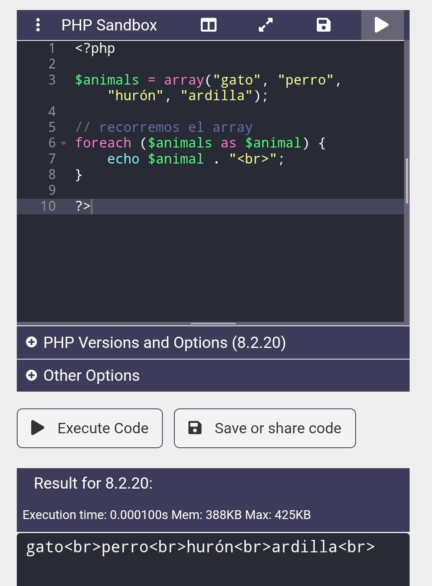
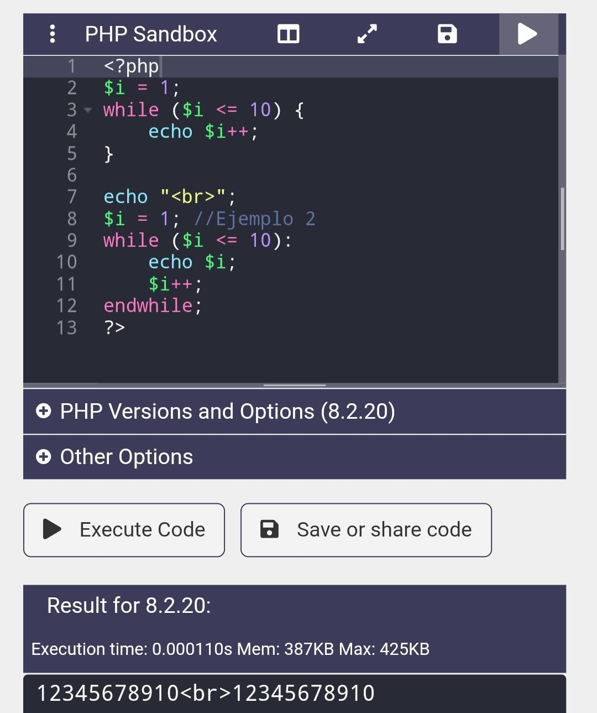
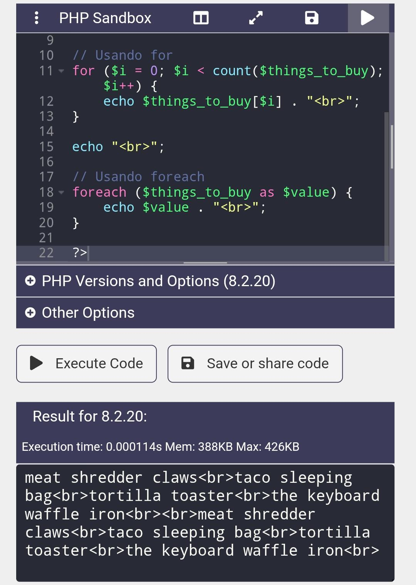
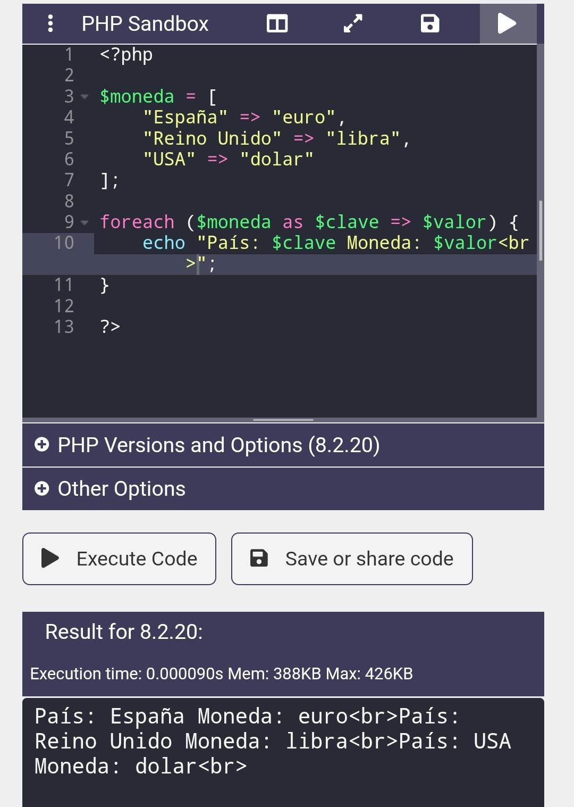
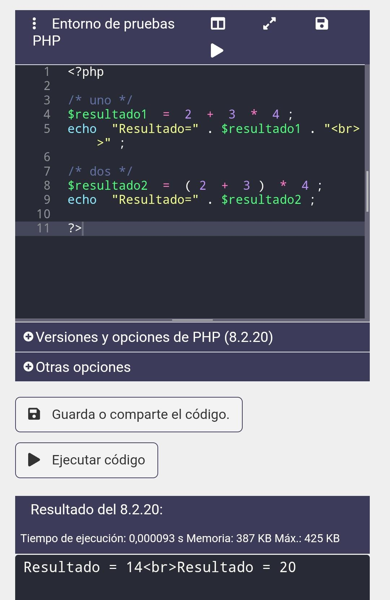

# Practicas de php-Software-VII
En esta práctica se desarrollan diferentes ejemplos en PHP para comprender el uso de estructuras de control, operaciones matemáticas, validaciones de datos y recorrido de arreglos.

## Nombre: Kathlyn Morales

## Materia: Desarrollo de Software VII

## Profesor: Ing. Irina Fong

--------------------------------------------------------------------------
## Ejercicio 1: Tamaños de texto

Este programa muestra diferentes tamaños de texto usando un ciclo for.

## Ejercicio 2: Validación de tipos de datos

Se verifica que las variables sean del tipo correcto antes de imprimir el mensaje.
Se utilizan funciones como is_integer() y is_string() para verificar que las variables sean del
tipo correcto antes de imprimir un mensaje.

---

## Ejercicio 3: Multiplicación

Se realiza una operación de multiplicación entre dos números.

---

## Ejercicio 4: Resta

Se realiza una operación de resta entre dos números.

---

## Ejercicio 5: Suma

Se realiza una operación de suma entre dos números.

---

## Ejercicio 6: Array con foreach

Se crea un arreglo de animales y se recorre utilizando foreach,
imprimiendo cada elemento en una nueva línea.

---

## Ejercicio 7: Ciclo while

Se muestran dos formas de usar el ciclo while:

Sintaxis tradicional con llaves {}
Sintaxis alternativa con endwhile

Ambas imprimen los números del 1 al 10.

---

## Ejercicio 8: Lista de elementos

Se utiliza foreach para recorrer un arreglo de objetos
(cosas por comprar) y mostrarlos en pantalla.

---

## Ejercicio 9: Array asociativo

Se crea un arreglo donde cada país tiene asociada su moneda.
Se utiliza foreach para mostrar tanto la clave (país) como el valor (moneda).

---

## Ejercicio 10: Orden de precedencia

Se demuestra la diferencia entre operaciones con y sin paréntesis.

